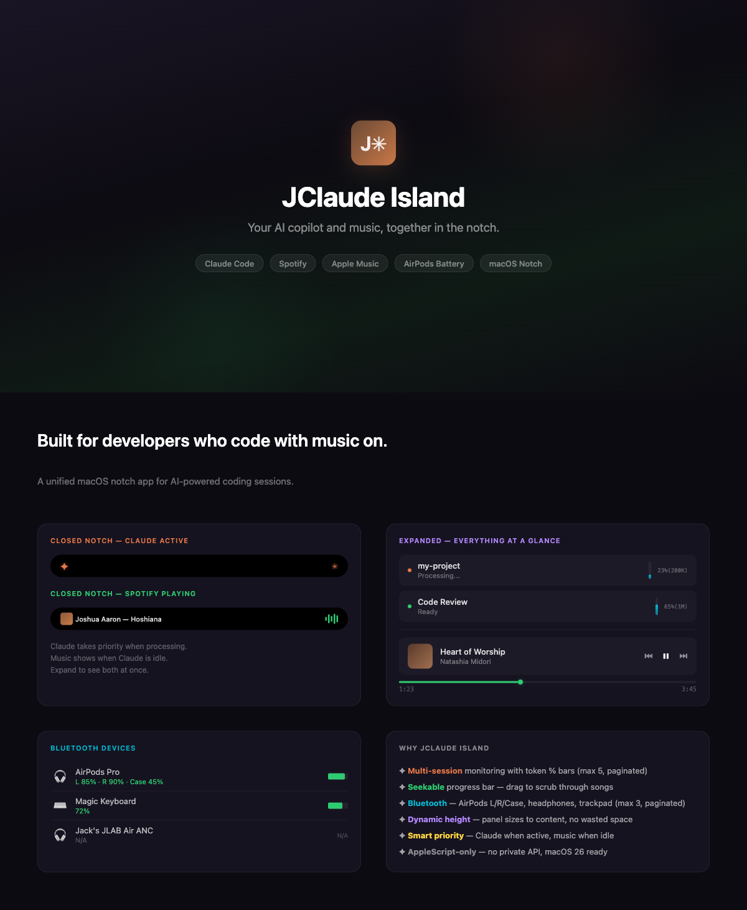

<div align="center">
  
  <h1>JClaude Island</h1>
  <p><strong>Answer Claude. Play music. Watch your battery. Without leaving the notch.</strong></p>
  <p>
    <a href="https://github.com/DKJTR/JClaude-Island/releases/latest"></a>
    <a href="#install"></a>
    <a href="https://github.com/DKJTR/JClaude-Island/blob/main/LICENSE.md"></a>
    <a href="https://github.com/DKJTR/JClaude-Island/stargazers"></a>
  </p>
</div>

---

JClaude Island is a macOS notch app for the people who live in Claude Code. It puts your active sessions, the question Claude is waiting on, your music, and your AirPods battery in the one place you're always looking — the notch. No window management. No alt-tab. No checking five different surfaces.

## Install

**Requirements:** macOS 15.0+, Claude Code CLI, Python 3 (system Python is fine).

```bash
curl -fsSL https://raw.githubusercontent.com/DKJTR/JClaude-Island/main/scripts/install.sh | bash
```

Downloads the signed DMG (SHA-256 verified), copies the app to `/Applications`, drops `claude-island-state.py` into `~/.claude/hooks/`, merges hook entries into `~/.claude/settings.json` (backs your config up first), and launches. Re-run any time to update.

<details>
<summary>Build from source</summary>

```bash
git clone https://github.com/DKJTR/JClaude-Island.git
cd JClaude-Island
xcodebuild -scheme ClaudeIsland -configuration Release build \
  -destination "platform=macOS,arch=arm64" \
  CODE_SIGN_IDENTITY="-"
cp -R ~/Library/Developer/Xcode/DerivedData/ClaudeIsland-*/Build/Products/Release/JClaude\ Island.app /Applications/
```

Then run `scripts/install.sh` once to wire the Claude Code hooks.
</details>

<details>
<summary>First-launch permissions</summary>

| Permission | Why |
|---|---|
| **Bluetooth** | Read battery levels of connected devices |
| **Apple Events** | Send messages to Claude Code in Terminal.app / iTerm2 |
| **Accessibility** | Type messages into Cursor / VS Code / Warp / Ghostty |

Skip any you don't need — the relevant features just won't fire.
</details>

## What's new in v1.4

> **AskUserQuestion in the notch — for real.** When Claude asks a question, the option chips render right in the island row. Click one and the terminal picker auto-submits. Mirror mode keeps both UIs in sync — answer in either place, the other clears.

> **Multi-terminal send.** The chat input now writes into tmux, Terminal.app, iTerm2, **Cursor**, **VS Code**, **Warp**, **Ghostty** — anywhere a Claude Code session can run. Auto-detected per session.

> **Differentiated indicators.** Permission prompts get a purple blinking pixel `?`. Questions get a static orange `?`. Both at once → the indicator alternates. You always know what kind of attention Claude needs.

> **One-line install.** `curl ... | bash` downloads the signed DMG, copies the app, wires the Claude Code hooks, and launches. Updates use the same line.

> **Hardened.** Peer-PID socket auth. Atomic settings write. AppleScript injection-safe. Path traversal blocked. Privacy log redaction. Full review in [Security & privacy](#security--privacy).

## How it works

**Closed notch** adapts to whatever needs your attention:

| State | Left wing | Right wing |
|---|---|---|
| Claude processing | Walking crab | Orange spinner |
| Permission needed | Crab + **purple blinking `?`** | Spinner |
| Question pending | Crab + **orange static `?`** | Spinner |
| Both pending | Crab + **alternating `?`** | Spinner |
| Music playing (Claude idle) | Album art + track | 5-bar waveform |
| BT device just paired | Device name | Green check (4s) |

**Expanded notch** stacks everything in one panel — Claude rows with token bars and inline option chips, a compact Now Playing strip, and connected Bluetooth devices with battery levels. Single-click any Claude row to open chat. Pagination tops out at 5 sessions and 3 devices visible at once.

Both Now Playing and Bluetooth can be hidden from the menu if you don't want them.

## Architecture

```
Claude Code hooks ──▶ python3 (~/.claude/hooks/) ──▶ AF_UNIX socket ──▶ SwiftUI notch
                                  ▲                                          │
                                  └────  hookSpecificOutput JSON  ◀──────────┘
                                                (decisions, answers)

Spotify / Apple Music  ──▶  AppleScript polling (2s)  ──▶  Now Playing state
Bluetooth devices      ──▶  IOBluetooth + IOKit (5s)  ──▶  Device list
```

The notch app and Claude Code communicate over a per-user AF_UNIX socket at `/tmp/dynamic-island.sock` (mode `0600`). Connections are gated by **peer-PID auth** — the socket only accepts clients whose ancestor chain includes a `claude` binary.

## Security & privacy

**No data leaves the box.** No telemetry, no analytics, no crash reporter. The app makes outbound calls to exactly two places: Sparkle's appcast for update checks, and GitHub URLs you click in the menu. Tool inputs, JSONL conversation logs, file paths, env vars — all stay on your machine.

Defenses currently in place:

- **Per-process socket auth** — connections rejected unless the peer's ancestor chain contains a Claude Code binary.
- **AppleScript injection-safe** — newlines + quotes escaped before any `keystroke "..."` literal.
- **Atomic settings write** — backup taken before first overwrite; mid-write crash can't lose your config.
- **Path traversal blocked** — `sessionId` regex-validated, JSONL paths must resolve inside `~/.claude/projects/`.
- **No payload in logs** — failed-parse events log byte counts, not contents.
- **Sandboxed AppleScript targets** — only Terminal, iTerm2, Spotify, and Apple Music can be addressed.

## Known limitations

- Chrome / YouTube media not detected (AppleScript can't reach them).
- Token usage is JSONL-parsed, not the model's internal context counter (close enough for the bar).
- Some BT devices don't report battery → shown as `N/A`.
- v1.4.0 DMG is ad-hoc signed; Developer-ID notarization tracked for v1.5.

## Roadmap

- [ ] Developer-ID notarized DMG + Sparkle EdDSA-signed updates
- [ ] Multi-select question support (currently first-pick only goes through; users can finish multi-select in terminal)
- [ ] Optional voice notification ("Claude needs you") via macOS speech synth
- [ ] Customizable indicator colors

## Acknowledgments

Built on [Claude Island](https://github.com/farouqaldori/claude-island) by Farouq Aldori. UX patterns inspired by [Alcove](https://tryalcove.com/) and [Vibe Island](https://vibeisland.app/).

## Support

If JClaude Island makes your day easier, [sponsor the work](https://github.com/sponsors/DKJTR). Free will always be free.

## License

Apache 2.0 — same as upstream.
