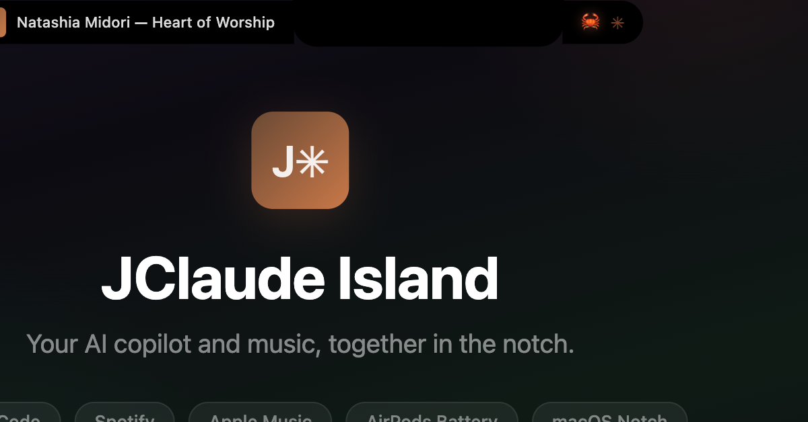

<div align="center">
  
  <h1>JClaude Island</h1>
  <p><strong>Your AI copilot and music, together in the notch.</strong></p>
  <br />
  
</div>

---

JClaude Island is a macOS notch app that brings Claude Code sessions, music playback, and Bluetooth device info into one place. Built on top of the excellent [Claude Island](https://github.com/farouqaldori/claude-island), with additional media and device integrations.

<div align="center">
  
</div>

## What It Does

**Closed notch** adapts to context:

| State | Left Wing | Right Wing |
|-------|-----------|------------|
| Claude processing | Crab icon | Orange spinner |
| Music playing (Claude idle) | Album art + track | Waveform animation |
| Both active | Claude takes priority | Expand to see both |

**Expanded notch** shows everything stacked:
- Claude session rows with token usage bars
- Spotify / Apple Music player with seekable progress bar
- Click on track name to open the music app
- AskUserQuestion prompts with pickable option buttons

## Features

**Claude Code**
- Multi-session monitoring with vertical token usage bars
- Tool permission approval directly from the notch
- AskUserQuestion prompts with clickable options
- Stale session detection (auto-idle after 30s)
- Session titles sync with `/rename`

**Now Playing**
- Spotify and Apple Music support
- Play / pause / next / previous controls
- Seekable progress bar with time labels
- Album art crossfade on track change
- Click track name to open the music app

**Bluetooth**
- Connected device list with battery levels
- AirPods Left / Right / Case breakdown

**Visual Polish**
- 5-bar organic waveform animation
- Frosted glass blur behind expanded panel
- Context-aware hover glow
- Mode-switch bounce animation

## Install

**Requirements:** macOS 15.0+, Xcode, Claude Code CLI

```bash
git clone https://github.com/DKJTR/JClaude-Island.git
cd JClaude-Island
xcodebuild -scheme ClaudeIsland -configuration Release build \
  -destination "platform=macOS,arch=arm64" \
  CODE_SIGN_IDENTITY="-"
```

Copy to Applications:

```bash
cp -R ~/Library/Developer/Xcode/DerivedData/ClaudeIsland-*/Build/Products/Release/JClaude\ Island.app /Applications/
```

Or open `ClaudeIsland.xcodeproj` in Xcode and hit **Cmd+R**.

Hooks auto-install on first launch.

## Architecture

```
Claude Code hooks --> Python (~/.claude/hooks/) --> Unix socket --> SwiftUI notch overlay
Spotify/Apple Music --> AppleScript polling (2s) --> Now Playing state
Bluetooth --> IOBluetooth + IOKit (30s polling) --> Device list
```

## Known Limitations

- Chrome / YouTube not supported (AppleScript limitation)
- Token count is approximate (JSONL-parsed, not internal context %)
- Ad-hoc signing only (uses AppleScript automation)

## Acknowledgments

Built on [Claude Island](https://github.com/farouqaldori/claude-island) by Farouq Aldori. Learned from [Alcove](https://tryalcove.com/) and [Vibe Island](https://vibeisland.app/) for UX patterns.

## License

Apache 2.0
